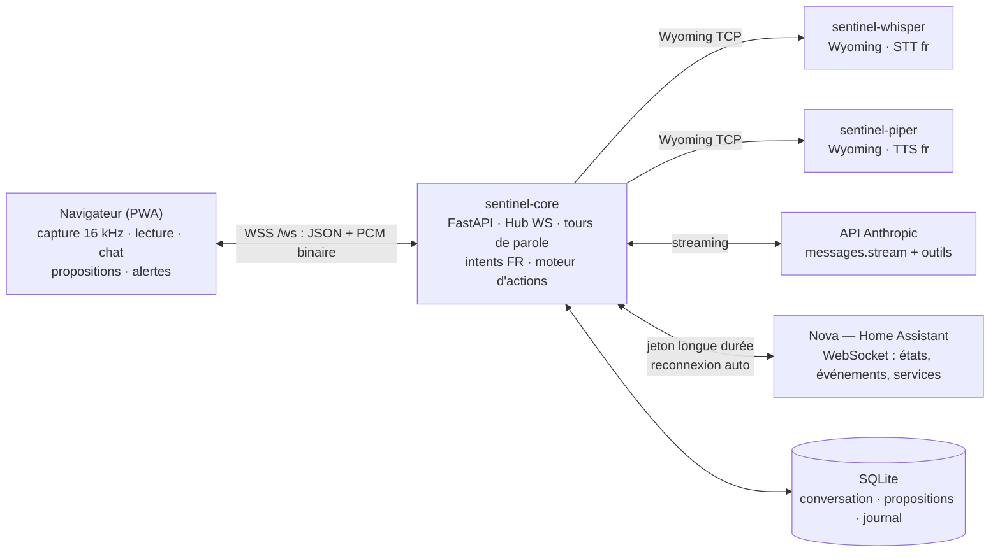
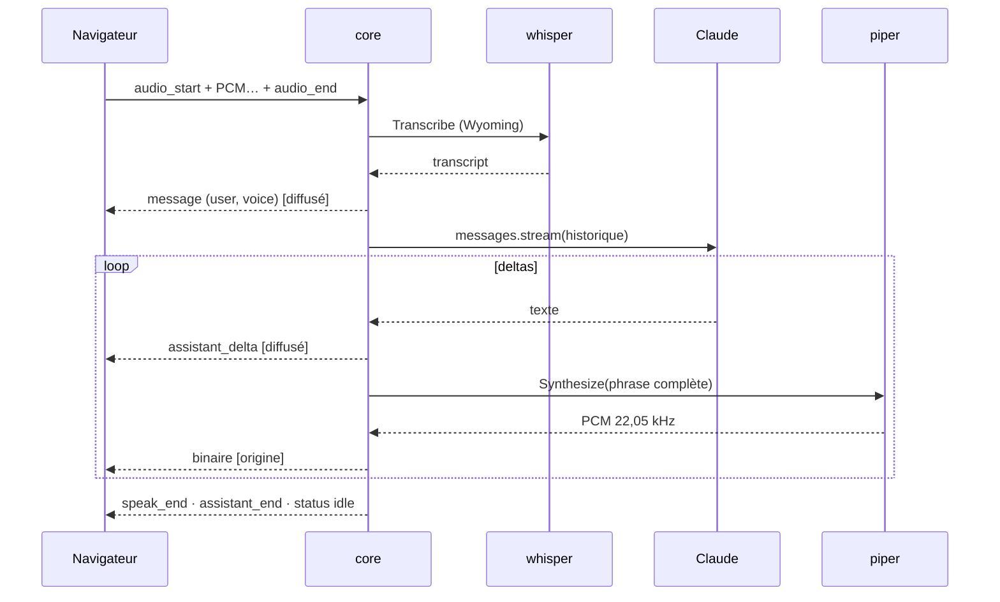

# Architecture — état courant (Phase 5 : mot d'éveil + agent Assist)

> Document vivant : mis à jour à chaque phase. La cible globale est décrite dans
> [PLAN.md](PLAN.md) ; ici, seulement ce qui **existe** et pourquoi.

## Vue d'ensemble

Trois conteneurs (`docker-compose.yml`). Seul `sentinel-core` est publié sur le LAN
(HTTPS 8443) ; whisper et piper vivent sur le réseau interne Docker et parlent le
protocole **Wyoming** (réutilisables plus tard par Nova/Assist et les satellites).
Le dossier `config/` (protocoles, alertes, alias) est monté en volume : éditable
sans reconstruction, rechargé au redémarrage du conteneur.

## Le moteur « propose puis approuve » (`core/app/actions/`)

Point de passage **unique** des écritures — PLAN §5, appliqué techniquement :

- **Registre** (`registry.py` + `executors.py`) : la liste blanche exhaustive.
  Chaque action déclare son risque (`low`/`medium`/`sensitive`) et si elle est
  exécutable en ordre direct. Les exécuteurs valident strictement leurs
  paramètres (domaines autorisés, bornes) — seuls fichiers, avec `ha/client.py`,
  à toucher `call_service`.
- **Ordre direct** : « allume la lumière » exécute immédiatement (l'ordre EST
  l'autorisation, journalisée avec la phrase exacte). Une action `sensitive`
  (déverrouiller, désarmer, protocole sensible) exige la **double
  confirmation** (« Sentinel, confirme », 60 s, annulable).
- **Propositions** : tout le reste (`ha.call_service` générique, initiatives)
  passe en file : `pending → approved/rejected/deferred → executing → done/failed`.
  Approbation à la voix pour risque faible/moyen ; **UI uniquement** pour le
  sensible. Exécution seulement après approbation — il n'existe aucun autre
  chemin dans le code.
- **Chemin « système »** : les règles d'alerte peuvent notifier (`ha.notify`)
  avec l'autorisation « règle X » — limité techniquement au risque `low`.
- **Journal** append-only : qui, quoi, quand, autorisation, résultat.
- **Boucle de vérification (brique 1)** : après un exécuteur réussi, le moteur
  relit l'état de Nova (`ActionEngine._verified` → `ActionSpec.verify`, défini
  dans `executors.py`) pour confirmer que l'ordre a pris effet, sur les trois
  chemins (direct, proposition, système). Le résultat porte alors un verdict
  honnête — « Vérifié côté Nova », « je n'ai pas pu le confirmer… — à vérifier »,
  ou rien pour une action non vérifiable par un simple état (scène, notification,
  musique). La vérification est en **lecture seule** (`get_state`, jamais
  `call_service` : l'invariant reste vert) et ne **rejoue jamais** l'action —
  un ordre sensible non confirmé n'est pas relancé automatiquement, il repasse
  par l'approbation. Une vérification qui échoue ne masque jamais le résultat réel.
- **Verrou statique** : `tests/test_invariant.py` interdit `call_service` et
  `_send_wait` hors des fichiers autorisés — la CI casse si on contourne.

## Nova (`core/app/ha/`)

- `client.py` : WebSocket HA (auth jeton, `get_states`, registres
  areas/entités/appareils, `subscribe_events`), cache d'états tenu à jour,
  reconnexion backoff (30 s max), commandes avec futures + timeout. Registres
  inaccessibles (jeton non admin) → mode dégradé sans résolution de pièces.
- `protocols.py` : chargement/validation de `config/protocols.yml`, phrases de
  déclenchement implicites (« protocole X », « mode X ») + explicites,
  normalisées sans accents. L'exécution est un exécuteur du moteur.
- `alerts.py` : règles de `config/alerts.yml` évaluées sur `state_changed` —
  transition entrante uniquement, condition optionnelle (ex. alarme armée),
  anti-rebond par (règle, entité). Déclenchement → annonce (fil + bannière +
  voix sur tous les appareils ; « critique » interrompt Sentinel) + notification
  via le moteur.

## Vision en lecture (`core/app/brain/vision.py`) — brique agentique

Luna REGARDE une caméra et DÉCRIT ce qu'elle voit — un **capteur**, jamais un
bras (voir `docs/VISION.md`).

- **Lecture de l'image** : `HAClient.camera_snapshot` lit un instantané via
  l'API REST `camera_proxy` de Nova (`GET`, pas `call_service` → hors invariant
  d'écriture, qui reste vert).
- **Description** : `VisionService` envoie l'image à un modèle multimodal
  **local** (RTX 2070) derrière une API compatible OpenAI (`image_url` en data
  URL). Aucune image ne quitte le réseau local.
- **Outil `regarder`** (Toolbox) : résout la caméra (pièce ou entity_id),
  renvoie une description. Réservé aux personnes reconnues (`known`) ; jamais une
  action — agir sur ce qu'elle voit repasse par une **proposition**. Absent si le
  service de vision ou une caméra manquent (dégradé propre).

## Surveillance (`core/app/monitors/`) — Phase 3A

- **Docker** (`docker.py`) via DEUX proxys tecnativa (aucun port LAN, socket
  jamais monté dans core) : `sentinel-dockerproxy` en lecture pure (tous les
  POST refusés — conteneurs, stats mémoire, logs démultiplexés) et
  `sentinel-dockerproxy-restart` qui n'expose QUE la route de redémarrage
  (`CONTAINERS=0` + `ALLOW_RESTARTS` : pas de liste, pas de création, pas
  d'exec). `restart_container` refuse de toucher Sentinel lui-même et n'est
  appelable que par l'exécuteur `docker.restart` — `direct=False`, donc
  **proposition obligatoire**. L'invariant statique couvre ce chemin
  (`test_invariant.py`).
- **Système** (`system.py`) : charge et RAM de l'hôte via `/proc`. Limite assumée :
  disques/SMART de l'array Unraid inaccessibles sans privilèges — passeront par
  les capteurs de Nova si une intégration les expose.
- **Nova** (dans `health.py`) : entités indisponibles (domaines « bruit » filtrés),
  entités `update.*` actives, version HA (get_config au bootstrap du client).
- **Atrium** (`atrium.py`) : healthcheck HTTP + latence (`ATRIUM_URL`).
- **`HealthService`** agrège le tout pour quatre consommateurs : l'outil LLM
  `sante_systemes`, l'intent local « comment vont les systèmes », l'**audit**
  déterministe (constats critique/attention/info + actions suggérées) et le
  **rapport quotidien** (planificateur asyncio, heure locale `SENTINEL_DAILY_REPORT`,
  publié dans le fil via `announce(speak=False)`).
- Outils LLM ajoutés : `sante_systemes`, `logs_conteneur`, `audit_systemes`
  (lecture) ; `redemarrer_conteneur` (crée une proposition, n'exécute jamais).

## Le routeur intents → LLM (`core/app/brain/`)

1. **Intents locaux** (`intents.py`) : mots-clés FR sur texte normalisé, pièces
   résolues par les areas de Nova (+ alias `config/intents.yml`). Couverts :
   lumières, volets, serrures, température, protocoles, propositions
   (approuver/refuser/reporter/lister), confirmation/annulation, heure/date.
   Latence < 1 s, zéro Internet, zéro token.
2. **LLM avec outils** (`llm.py` + `toolbox.py`) : boucle manuelle en streaming
   (texte diffusé pendant les tours d'outils, 6 tours max). Lecture libre
   (`etat_maison`, `liste_pieces`, `details_entite`, `lister_propositions`) ;
   actions uniquement via le moteur (`action_domotique`, `lancer_protocole`,
   `creer_proposition`). Le déverrouillage/désarmement est **absent** des
   outils, volontairement.

## Protocole WebSocket (`/ws`)

Un seul canal par appareil. Les événements de conversation sont **diffusés à tous** les
appareils connectés (fil unique partagé) ; l'audio de la réponse ne va qu'à l'appareil
qui a parlé. Les tours venus d'Assist (API `/v1`, hors WebSocket) sont eux aussi
diffusés au fil, pour que téléphone et web partagent la même conversation.

### Client → serveur

| Message | Payload | Rôle |
|---|---|---|
| `chat` | `{text, speak?}` | Message écrit (réponse parlée si `speak: true`, défaut non) |
| `audio_start` | `{rate}` | Début de capture micro (interrompt la réponse en cours) |
| *(binaire)* | PCM 16 bits mono | Chunks micro, entre `audio_start` et `audio_end` |
| `audio_end` | — | Fin de capture → transcription → tour de parole |
| `audio_cancel` | — | Abandon de la capture (rien n'est transcrit) |
| `cancel` | — | Interrompt le tour en cours (LLM + voix) |
| `proposal_decision` | `{id, decision}` | `approve` · `reject` · `defer` depuis l'UI |
| `wake_start` | `{rate}` | Ouvre une session de veille au mot d'éveil ; le PCM suit en binaire (hors capture) |
| `wake_stop` | — | Ferme la session de veille |
| `dev_tasks` | — | Panneau atelier : liste des tâches + état (auth, push, dépôts) |
| `dev_log` | `{id, after}` | Journal en direct d'une tâche (incrémental : `after` = dernier `next` reçu) |
| `dev_diff` | `{id}` | Diff complet d'une tâche |
| `sante` | — | Instantané santé (panneau santé) |
| `historique` | — | Journal des actions + propositions passées |
| `ping` | — | Maintien de connexion (le serveur répond `pong`) |

Les cinq requêtes de panneau sont de la **lecture pure** (aucune action possible par
ce chemin) et reçoivent leur réponse du même type, adressée au seul demandeur.

**Mot d'éveil (Phase 5A)** : hors capture, les trames binaires alimentent une
session de veille (`WakeStream`) ouverte vers `sentinel-openwakeword`. Le lecteur
de la session tourne dans un task dédié ; à la détection il invoque son callback
(qui émet `wake`) puis **se termine de lui-même** et ferme sa connexion — il ne
s'auto-annule jamais (annuler le task pendant que le callback envoie couperait
l'envoi). La capture d'un tour de parole est prioritaire : tant qu'elle est
active, l'audio ne va pas à la veille.

### Serveur → client(s)

| Message | Payload | Rôle |
|---|---|---|
| `hello` | `{version, state, history, ha_configured, ha_connected, dev_configured, proposals, protocols}` | À la connexion : état + 50 derniers messages + file de propositions |
| `status` | `{state}` | `idle` · `listening` · `transcribing` · `thinking` · `speaking` |
| `message` | `{message}` | Message persisté (`source: text\|voice\|alert`) |
| `ha_status` | `{connected}` | Connexion à Nova (pastille de l'UI) |
| `activity` | `{text}` | Ce que fait Sentinel pendant la réflexion (« consulte Nova… ») |
| `alert` | `{level, text}` | Alerte proactive (`info`/`warning`/`critical`) — bannière |
| `proposal_new` | `{proposal}` | Nouvelle proposition dans la file |
| `proposal_update` | `{proposal}` | Changement de statut d'une proposition |
| `assistant_start` | `{id}` | Début de réponse |
| `assistant_delta` | `{id, text}` | Delta de texte (streaming) |
| `assistant_end` | `{id, message, cancelled}` | Fin (message persisté, ou `null` si rien) |
| `speak_start` | `{rate}` | La voix arrive (fréquence du PCM) — *origine seulement* |
| *(binaire)* | PCM 16 bits mono | Chunks de voix Piper — *origine seulement* |
| `speak_end` | — | Fin du flux vocal — *origine seulement* |
| `notice` | `{text}` | Information non bloquante (« Je n'ai rien entendu. ») |
| `error` | `{text}` | Erreur à afficher (clé API absente, service injoignable…) |
| `dev_status` | `{running}` | Tâche de dev en cours (`{id, repo}` ou `null`) — pastille ⚒ |
| `wake` | `{name}` | Mot d'éveil détecté — le client joue un carillon et passe en écoute |
| `wake_error` | `{text}` | Veille impossible (service injoignable, non configuré) |
| `dev_tasks` · `dev_log` · `dev_diff` · `sante` · `historique` | *(réponses)* | Réponses aux requêtes de panneau (`error` en cas d'échec) — *demandeur seulement* |

## Agent conversationnel Assist (Phase 5B)

En plus du WebSocket, `sentinel-core` expose une **API compatible OpenAI** —
`POST /v1/chat/completions`, `GET /v1/models` — protégée par un jeton porteur
(`SENTINEL_ASSIST_TOKEN` ; vide = 404). Nova s'y connecte via l'intégration HACS
*Extended OpenAI Conversation*, ce qui fait de Sentinel un **agent
conversationnel** choisissable dans un pipeline Assist (app HA, satellites).

- L'endpoint extrait le dernier message `user`, appelle `run_assist_reply`
  (source `assist`) : même routage intents→LLM+outils que le chat écrit, réponse
  renvoyée en une fois (non-streaming — ce qu'attend l'intégration), et **tour
  diffusé au hub** pour que l'interface web reflète la conversation. Nova gère la
  voix (STT/TTS de son pipeline, éventuellement les conteneurs Wyoming de
  Sentinel réutilisés tels quels).
- **Sécurité** : source `assist` traitée comme la voix ; les actions sensibles
  passent par la double confirmation, et l'approbation d'une proposition sensible
  est désormais réservée à l'interface (`via != "ui"` refuse voix, texte **et**
  Assist). Les Echo Dot (Alexa) ne sont pas des satellites possibles (fermés) —
  cf. [ASSIST.md](ASSIST.md).

## Audio

- **Montée (micro)** : `getUserMedia` → `AudioWorklet` (`ui/js/pcm-worklet.js`) →
  rééchantillonnage linéaire vers **16 kHz mono PCM16** → trames binaires WS (~128 ms).
  Fin de phrase détectée côté client au **silence** (RMS < 0,02 pendant 1,3 s), avec
  plafonds (7 s sans voix, 45 s au total) ; le serveur borne aussi à 60 s.
- **Descente (voix)** : Piper renvoie du PCM **22 050 Hz** streamé chunk par chunk ;
  le client planifie des `AudioBuffer` bout à bout (Web Audio rééchantillonne seul).
- **Latence** : la réponse LLM est découpée en **phrases** (`SentenceChunker`) envoyées à
  Piper au fil du streaming — Sentinel parle dès la première phrase terminée. Le texte
  passe par `markdown_to_speech` (le code, les tableaux et le style ne sont pas lus).
- **Mot d'éveil (Phase 5A)** : quand la veille est active et l'appareil au repos, le
  même flux 16 kHz est envoyé en continu au serveur, qui le relaie à openWakeWord. La
  détection est **locale** (aucun audio ne quitte le LAN avant le mot d'éveil) ; à la
  détection, le client joue un carillon (WebAudio) et bascule sur une écoute normale.
  L'`AudioContext` du navigateur exigeant un geste utilisateur, la veille se (ré)arme
  au premier clic si nécessaire.

## Le tour de parole

Un seul tour actif à la fois (`Sentinel.start_turn`), **interruptible** : un nouveau
message, une nouvelle prise de parole ou `cancel` annule proprement le tour courant
(tâche asyncio annulée, partiel conservé et marqué « interrompu », états rediffusés).

## Cerveau (Phase 1)

- `anthropic.AsyncAnthropic().messages.stream(...)`, modèle configurable
  (`claude-sonnet-5` par défaut), `output_config.effort` configurable (`low` par défaut :
  latence et coût minimaux pour la conversation courante).
- System prompt en deux blocs : persona **stable** (avec `cache_control` → mis en cache
  côté API) puis date/heure **variable** après le point de cache.
- Historique : fenêtre glissante (30 messages), premier message toujours `user`.
- Erreurs typées traduites en messages français (`LLMUnavailable`) affichés dans l'UI.
- **Aucun outil** : le tool use arrive en Phase 2, exclusivement à travers le moteur
  « propose puis approuve » (PLAN §5).

### Multi-LLM (`brain/providers.py`)

Claude reste le cerveau de **référence** (piloté nativement, recherche web comprise).
D'autres modèles — ChatGPT, Gemini, Groq, OpenRouter — se branchent via un **adaptateur
compatible OpenAI** unique et se choisissent **à chaud** dans le cockpit. Le `Brain`
**dispatche** selon le fournisseur actif ; le callback `run_tool` (Toolbox → moteur)
est le **même** dans les deux chemins, donc les garde-fous sont identiques quel que
soit le modèle (test statique + `test_providers.py`). Clés API, modèle par
fournisseur, effort/tokens/historique et fournisseur actif sont **éditables à chaud
depuis le cockpit** (Paramètres › Moteur) et persistés (`Store`, clé JSON
`llm_config`) ; les clés restent côté serveur, jamais réaffichées. `apply_config`
reconstruit le tout sans redémarrage. Voir `docs/MULTI-LLM.md`.

### Réglages éditables & précédence `.env`

Plusieurs réglages autrefois figés dans `.env` sont désormais **éditables à chaud
depuis le cockpit** et persistés dans le `Store` (jamais dans `.env`) :

- **Modèles LLM** (clés, modèle par fournisseur, effort/tokens/historique) — clé
  `llm_config` ; voir ci-dessus.
- **Mot d'éveil** (Paramètres › Voix & réveil) — clé `wake_model` ; `Detect` ne
  déclenche que sur ce mot, et `_wake_start` prévient si le mot n'est pas chargé.
- **Connexion Home Assistant** (Paramètres › Connexions) — URL + jeton (clés
  `ha_url`/`ha_token`) ; `HAClient.reconfigure()` rebranche la connexion **à chaud**
  en gardant la même instance, donc le moteur d'actions et la Toolbox ne sont pas
  reconstruits. Le jeton reste côté serveur, jamais réaffiché. Limite : si HA
  n'était pas configuré au démarrage (graphe d'actions non bâti), l'activer demande
  un redémarrage.

**Précédence, une seule règle** : réglage du **cockpit** (base) **>** `.env` **>**
défaut. Conséquence utile à retenir : une fois qu'une valeur est réglée dans le
cockpit, modifier le `.env` correspondant n'a plus d'effet tant qu'on n'a pas vidé
le champ dans le cockpit (ce qui rétablit le repli sur `.env`).

## Persistance

SQLite (`data/sentinel.db`, WAL) via aiosqlite. Table unique `messages`
(id, conversation_id, role, content, source, created_at) — `conversation_id` déjà là
pour des fils multiples futurs, sans migration.

## Décisions & compromis assumés (à revisiter)

| Sujet | Choix Phase 1 | Suite prévue |
|---|---|---|
| Conteneur core en root | Simplifie le volume `./data` monté par compose sur Unraid ; aucun socket sensible monté | Utilisateur dédié + gestion des droits en phase de durcissement |
| Images `rhasspy/*:latest` | Suivi de l'écosystème sans friction | Épingler des tags une fois la stack stabilisée |
| Détection de silence côté client (RMS) | Simple, zéro dépendance | VAD serveur (silero) si besoin en mode mains-libres (Phase 5) |
| Rééchantillonnage linéaire 48→16 kHz | Suffisant pour la parole (whisper y est robuste) | Filtre anti-repliement si la qualité STT déçoit |
| Un seul fil de conversation global | Correspond à l'usage (un foyer, un assistant) | `conversation_id` prêt si séparation nécessaire |
| Certificat auto-signé par défaut | Zéro friction au premier lancement | mkcert documenté ; authentification avant toute exposition |

## Compromis supplémentaires de la Phase 2 (assumés)

| Sujet | Choix | Suite prévue |
|---|---|---|
| Annonce vocale pendant qu'un utilisateur parle à Sentinel | l'annonce attend la fin du tour (30 s max), sauf `critical` qui interrompt ; un chevauchement audio reste théoriquement possible | file audio par client si le besoin se confirme |
| Approbation « texte » des propositions sensibles | traitée comme l'UI (même canal authentifié par l'accès LAN) ; seule la **voix** est restreinte | authentification utilisateur avant toute exposition hors LAN |
| Cibles des protocoles | identifiants natifs HA (`entity_id`/`area_id`), pas de noms parlés | résolution de noms si l'édition YAML s'avère pénible |
| Rechargement de `config/` | au redémarrage du conteneur (2 s) | rechargement à chaud si le besoin se confirme |
| `for:` (durée) dans les alertes | non géré (transition immédiate uniquement) | timers si un vrai cas l'exige |

## Atelier de développement (Phase 3B)

- **`sentinel-worker`** (conteneur dédié, `worker/`) : CLI Claude Code headless
  + mini-API FastAPI interne (aucun port LAN). Isolation stricte : il ne reçoit
  que `CLAUDE_CODE_OAUTH_TOKEN`/`ANTHROPIC_API_KEY`, `GITHUB_TOKEN` et
  `DEV_REPOS` — ni jeton Nova, ni socket Docker. Volume nommé `worker-workspace`
  (clones jetables). Tourne en non-root (exigé par le mode headless).
- **Flux d'une tâche** : `POST /tasks` (dépôt de la liste blanche uniquement,
  une tâche à la fois) → clone `--depth 50` → branche `sentinel/<id>` →
  `claude -p … --output-format stream-json --dangerously-skip-permissions`
  (acceptable car le conteneur EST le bac à sable) → commit → `diff.patch` +
  résumé. Persistance `tasks.json`, secrets purgés de toute sortie, 30 tâches
  gardées.
- **Journal en direct (Phase 4)** : la sortie `stream-json` est traduite ligne à
  ligne en français (`worker/streamlog.py` : « ▸ modifie README.md », texte de
  l'assistant, résultat final) dans un tampon mémoire borné par tâche, servi par
  `GET /tasks/{id}/log?after=N` (lecture incrémentale). La console de l'atelier
  dans l'UI le sonde toutes les 2 s pendant qu'une tâche tourne. Le tampon ne
  survit pas à un redémarrage du worker — le résumé et le diff, si.
- **Côté core** (`app/devwork/`) : `WorkerClient` (lecture libre ; `start_task`
  et `push_branch` réservés aux exécuteurs — invariant testé) ; actions au
  registre : `dev.task` (**direct, risque faible** : n'écrit que dans le bac à
  sable, journalisé avec la demande) et `dev.push` (**propositions uniquement** :
  écriture GitHub) ; `DevWatcher` (boucle 15 s) annonce les fins de tâches et
  crée automatiquement la proposition de push quand il y a un diff.
- **Outils LLM** : `lancer_tache_dev` (demande explicite), `etat_taches_dev`,
  `lire_diff_dev`.
- **Authentification** : jeton OAuth du forfait Pro/Max (`claude setup-token`)
  en priorité, clé API en repli — le gros des tokens de dev est donc couvert
  par l'abonnement, l'API ne payant que la conversation vocale.
- Déploiement : Guillaume merge la branche sur GitHub puis met à jour via HACS
  (Loggia) ou l'image (Atrium) — la prod n'est jamais modifiée par Sentinel.
