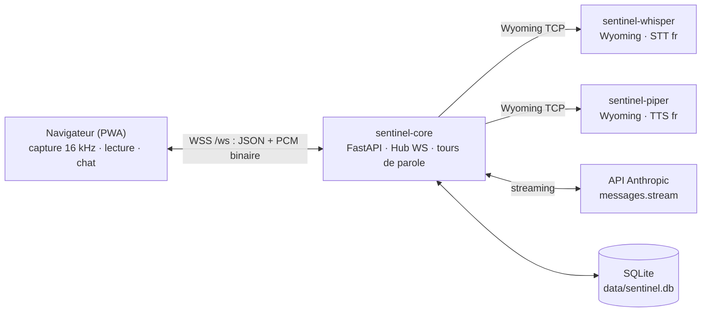
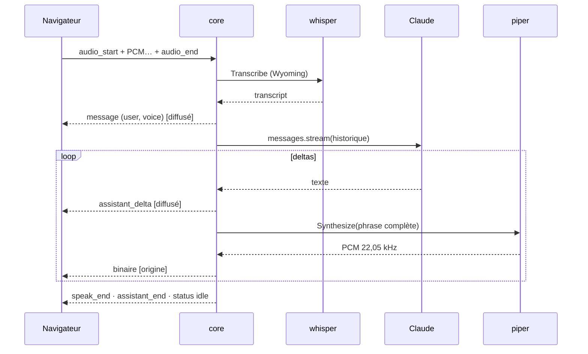

# Architecture — état courant (fin de Phase 1)

> Document vivant : mis à jour à chaque phase. La cible globale est décrite dans
> [PLAN.md](PLAN.md) ; ici, seulement ce qui **existe** et pourquoi.

## Vue d'ensemble

Trois conteneurs (`docker-compose.yml`). Seul `sentinel-core` est publié sur le LAN
(HTTPS 8443) ; whisper et piper vivent sur le réseau interne Docker et parlent le
protocole **Wyoming** (réutilisables plus tard par Nova/Assist et les satellites).

## Protocole WebSocket (`/ws`)

Un seul canal par appareil. Les événements de conversation sont **diffusés à tous** les
appareils connectés (fil unique partagé) ; l'audio de la réponse ne va qu'à l'appareil
qui a parlé.

### Client → serveur

| Message | Payload | Rôle |
|---|---|---|
| `chat` | `{text, speak?}` | Message écrit (réponse parlée si `speak: true`, défaut non) |
| `audio_start` | `{rate}` | Début de capture micro (interrompt la réponse en cours) |
| *(binaire)* | PCM 16 bits mono | Chunks micro, entre `audio_start` et `audio_end` |
| `audio_end` | — | Fin de capture → transcription → tour de parole |
| `audio_cancel` | — | Abandon de la capture (rien n'est transcrit) |
| `cancel` | — | Interrompt le tour en cours (LLM + voix) |
| `ping` | — | Maintien de connexion (le serveur répond `pong`) |

### Serveur → client(s)

| Message | Payload | Rôle |
|---|---|---|
| `hello` | `{version, state, history}` | À la connexion : état + 50 derniers messages |
| `status` | `{state}` | `idle` · `listening` · `transcribing` · `thinking` · `speaking` |
| `message` | `{message}` | Message utilisateur persisté (`source: text\|voice`) |
| `assistant_start` | `{id}` | Début de réponse |
| `assistant_delta` | `{id, text}` | Delta de texte (streaming) |
| `assistant_end` | `{id, message, cancelled}` | Fin (message persisté, ou `null` si rien) |
| `speak_start` | `{rate}` | La voix arrive (fréquence du PCM) — *origine seulement* |
| *(binaire)* | PCM 16 bits mono | Chunks de voix Piper — *origine seulement* |
| `speak_end` | — | Fin du flux vocal — *origine seulement* |
| `notice` | `{text}` | Information non bloquante (« Je n'ai rien entendu. ») |
| `error` | `{text}` | Erreur à afficher (clé API absente, service injoignable…) |

## Audio

- **Montée (micro)** : `getUserMedia` → `AudioWorklet` (`ui/js/pcm-worklet.js`) →
  rééchantillonnage linéaire vers **16 kHz mono PCM16** → trames binaires WS (~128 ms).
  Fin de phrase détectée côté client au **silence** (RMS < 0,02 pendant 1,3 s), avec
  plafonds (7 s sans voix, 45 s au total) ; le serveur borne aussi à 60 s.
- **Descente (voix)** : Piper renvoie du PCM **22 050 Hz** streamé chunk par chunk ;
  le client planifie des `AudioBuffer` bout à bout (Web Audio rééchantillonne seul).
- **Latence** : la réponse LLM est découpée en **phrases** (`SentenceChunker`) envoyées à
  Piper au fil du streaming — Sentinel parle dès la première phrase terminée. Le texte
  passe par `markdown_to_speech` (le code, les tableaux et le style ne sont pas lus).

## Le tour de parole

Un seul tour actif à la fois (`Sentinel.start_turn`), **interruptible** : un nouveau
message, une nouvelle prise de parole ou `cancel` annule proprement le tour courant
(tâche asyncio annulée, partiel conservé et marqué « interrompu », états rediffusés).

## Cerveau (Phase 1)

- `anthropic.AsyncAnthropic().messages.stream(...)`, modèle configurable
  (`claude-sonnet-5` par défaut), `output_config.effort` configurable (`low` par défaut :
  latence et coût minimaux pour la conversation courante).
- System prompt en deux blocs : persona **stable** (avec `cache_control` → mis en cache
  côté API) puis date/heure **variable** après le point de cache.
- Historique : fenêtre glissante (30 messages), premier message toujours `user`.
- Erreurs typées traduites en messages français (`LLMUnavailable`) affichés dans l'UI.
- **Aucun outil** : le tool use arrive en Phase 2, exclusivement à travers le moteur
  « propose puis approuve » (PLAN §5).

## Persistance

SQLite (`data/sentinel.db`, WAL) via aiosqlite. Table unique `messages`
(id, conversation_id, role, content, source, created_at) — `conversation_id` déjà là
pour des fils multiples futurs, sans migration.

## Décisions & compromis assumés (à revisiter)

| Sujet | Choix Phase 1 | Suite prévue |
|---|---|---|
| Conteneur core en root | Simplifie le volume `./data` monté par compose sur Unraid ; aucun socket sensible monté | Utilisateur dédié + gestion des droits en phase de durcissement |
| Images `rhasspy/*:latest` | Suivi de l'écosystème sans friction | Épingler des tags une fois la stack stabilisée |
| Détection de silence côté client (RMS) | Simple, zéro dépendance | VAD serveur (silero) si besoin en mode mains-libres (Phase 5) |
| Rééchantillonnage linéaire 48→16 kHz | Suffisant pour la parole (whisper y est robuste) | Filtre anti-repliement si la qualité STT déçoit |
| Un seul fil de conversation global | Correspond à l'usage (un foyer, un assistant) | `conversation_id` prêt si séparation nécessaire |
| Certificat auto-signé par défaut | Zéro friction au premier lancement | mkcert documenté ; authentification avant toute exposition |

## Repères pour la Phase 2

- Le moteur d'actions (`core/app/actions/`) devient **l'unique** chemin d'écriture ;
  les outils LLM d'action ne font que créer des propositions ou invoquer ce moteur.
- Client WebSocket Nova (`core/app/ha/`) : token `.env` (déjà prévu), abonnements
  d'événements, cache des registres (areas/entités) pour les intents FR.
- Le routeur d'intents s'insère **avant** l'appel LLM dans `run_reply_turn`
  (`core/app/main.py`) — l'emplacement est volontairement unique et évident.
- Nouveaux événements WS à prévoir : `proposal_*` (file d'attente), `protocol_*`.
