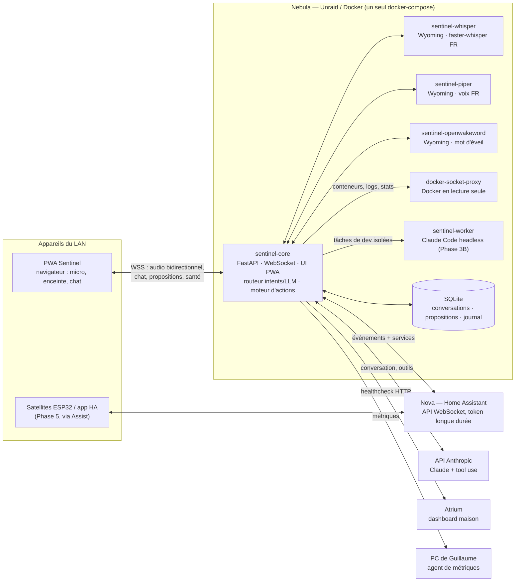
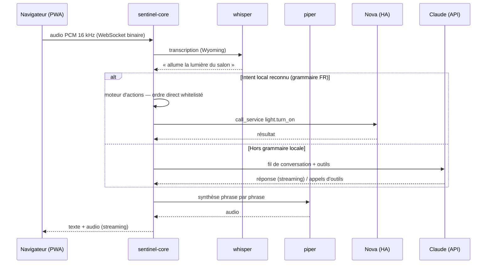

# Sentinel — Plan de projet (Phase 0)

> **Statut : validé par Guillaume le 31/08/2026**, avec les décisions suivantes :
> mot d'éveil **openWakeWord** ; whisper **`small-int8` CPU** par défaut (GPU de Nebula à
> confirmer, bascule facile) ; modèle d'autorisation du §5 (« ordre direct = exécution
> immédiate pour la domotique whitelistée, proposition pour tout le reste, double
> confirmation pour le sensible ») **confirmé** ; scission 3A/3B acceptée.
> L'état d'avancement réel est tenu à jour dans [ARCHITECTURE.md](ARCHITECTURE.md).

---

## 1. Vision (rappel) et principes directeurs

**Sentinel** est un assistant personnel type Jarvis, auto-hébergé sur **Nebula** (Unraid/Docker),
en français, utilisable **à la voix et à l'écrit** depuis tout appareil du LAN disposant d'un
micro et d'une enceinte. La voix et le chat écrit alimentent **le même fil de conversation**.

Quatre principes structurent tout le projet :

1. **Local d'abord** — mot d'éveil, STT et TTS tournent sur Nebula. Les commandes domotiques
   courantes fonctionnent sans Internet. Le LLM (API Anthropic) n'intervient que pour la
   conversation, le diagnostic et les tâches complexes.
2. **Propose puis approuve** — toute écriture non ordonnée explicitement par Guillaume passe
   par une proposition approuvée. C'est un verrou **technique** dans le moteur d'exécution,
   pas une convention (détail au §5, c'est le cœur du projet).
3. **Compatible écosystème Assist** — les briques vocales parlent le protocole **Wyoming**,
   donc réutilisables par Home Assistant et, plus tard, par des satellites ESP32.
4. **Simplicité maîtrisée** — pas de framework front, pas de base de données externe, pas de
   bus de messages. Un système que Guillaume comprend de bout en bout (voir §13).

---

## 2. Architecture générale



**Flux voix / texte** (identiques à partir du routeur) :



**Proactivité** : `sentinel-core` est abonné aux événements de Nova (et lit les moniteurs
locaux). Une règle d'alerte déclenchée → Sentinel **parle** sur les clients connectés et/ou
notifie le téléphone via HA. Une **initiative** (idée d'action) → création d'une proposition
dans la file, jamais d'exécution directe.

---

## 3. Découpage des services Docker

Un **unique `docker-compose.yml`** à la racine. Seul `sentinel-core` est exposé sur le LAN ;
tout le reste vit sur le réseau interne Docker.

| Service | Image | Rôle | Port | Introduit en |
|---|---|---|---|---|
| `sentinel-core` | build local (`python:3.12-slim`) | Cerveau : API + WebSocket, UI PWA, routeur intents/LLM, moteur d'actions, client HA, clients Wyoming, SQLite | `8443` (HTTPS/WSS, LAN) | Phase 1 |
| `sentinel-whisper` | `rhasspy/wyoming-whisper` | STT faster-whisper, `--model small-int8 --language fr` | `10300` (interne) | Phase 1 |
| `sentinel-piper` | `rhasspy/wyoming-piper` | TTS, voix `fr_FR-siwis-medium` | `10200` (interne) | Phase 1 |
| `sentinel-openwakeword` | `rhasspy/wyoming-openwakeword` | Mot d'éveil (« hey jarvis » fourni, « sentinel » entraîné ensuite) | `10400` (interne) | Phase 5* |
| `sentinel-dockerproxy` | `tecnativa/docker-socket-proxy` | Accès Docker **en lecture seule** (conteneurs, logs, stats) — le socket n'est jamais monté dans core | `2375` (interne) | Phase 3A |
| `sentinel-worker` | build local (CLI Claude Code) | Tâches de dev déléguées, headless, volume `workspace/` isolé — jamais d'accès à la prod | — (interne) | Phase 3B |

\* Le conteneur openWakeWord peut être présent dès le début dans le compose (profil désactivé) ;
il ne sert qu'aux flux continus des satellites. Jusqu'à la Phase 5, la PWA fonctionne en
appui-pour-parler (bouton / raccourci clavier), conformément au phasage demandé.

**Volumes** : `./data` (SQLite, journal, caches) · volumes nommés pour les modèles
whisper/piper (téléchargés au premier démarrage) · `./workspace` (Phase 3B) ·
`/var/run/docker.sock:ro` monté **uniquement** dans le socket-proxy.

**Pourquoi des conteneurs séparés pour STT/TTS ?** Ce sont les images officielles de
l'écosystème Rhasspy/HA : zéro maintenance, protocole Wyoming natif, et Nova pourra les
utiliser directement comme fournisseurs STT/TTS d'Assist (Phase 5) sans rien dupliquer.

---

## 4. Arborescence du dépôt

Le dépôt étant vierge, **Sentinel occupe la racine** : structure propre, licence MIT,
publiable telle quelle sous l'organisation Alardware plus tard (simple transfert/renommage).

```
.
├── docker-compose.yml          # tout Sentinel en une commande
├── .env.example                # HA_URL, HA_TOKEN, ANTHROPIC_API_KEY, modèle LLM, ports…
├── .gitignore                  # data/, workspace/, .env, certificats
├── LICENSE                     # MIT
├── README.md                   # install Unraid, config token HA, usage, FAQ
├── docs/
│   ├── PLAN.md                 # ce document
│   ├── ARCHITECTURE.md         # schémas + décisions, tenu à jour à chaque phase
│   ├── PROTOCOLES.md           # définir/ajouter un protocole
│   ├── OUTILS-LLM.md           # ajouter un outil au cerveau
│   └── reviews/                # briefs de revue Codex, un par phase
├── core/
│   ├── Dockerfile
│   ├── requirements.txt
│   ├── app/
│   │   ├── main.py             # FastAPI : HTTP + WebSocket temps réel + fichiers UI
│   │   ├── config.py           # lecture/validation du .env
│   │   ├── voice/              # sessions audio, détection de silence, clients Wyoming
│   │   ├── brain/              # routeur : intents locaux ↔ LLM (tool use, streaming)
│   │   │   └── tools/          # outils exposés au LLM — 1 fichier = 1 domaine
│   │   ├── actions/            # LE moteur propose→approuve : registre, file, journal
│   │   ├── ha/                 # client WebSocket Nova, événements, protocoles, alertes
│   │   ├── monitors/           # santé Nebula / Atrium / PC / conteneurs (Phase 3A)
│   │   ├── audits/             # audits sécurité & performance (Phase 3A)
│   │   ├── devwork/            # délégation Claude Code (Phase 3B)
│   │   └── store/              # SQLite : conversations, propositions, journal
│   └── tests/                  # pytest — dont les tests du verrou d'autorisation
├── ui/                         # PWA statique servie par core — SANS étape de build
│   ├── index.html
│   ├── manifest.webmanifest
│   ├── sw.js                   # service worker (installable, cache statique)
│   ├── css/
│   └── js/                     # modules ES natifs : audio, ws, chat, viz, propositions, santé
├── config/
│   ├── protocols.yml           # Forteresse, Nuit, Absence, Cinéma… (générique)
│   ├── alerts.yml              # règles d'alerte proactive
│   └── intents.yml             # vocabulaire/alias FR des intents locaux
├── worker/                     # Phase 3B : Dockerfile du conteneur Claude Code headless
├── satellites/                 # Phase 5 : doc + configs ESP32-S3 / Assist
└── scripts/                    # utilitaires dev : lancement local, lint, tests, cert local
```

Convention : **identifiants de code en anglais** (standard), **commentaires, UI, docs et
réponses de Sentinel en français**.

---

## 5. Le moteur « propose puis approuve » — modèle d'autorisation

C'est le point le plus important à valider. La règle brute « toute écriture exige une
proposition approuvée » rendrait l'assistant vocal inutilisable : « allume la lumière du
salon » ne doit pas créer une proposition à approuver — l'ordre vocal **est** l'autorisation.
Je propose donc ce modèle, qui garde un **point de passage unique et un refus technique** :

**Toute action d'écriture, sans exception, passe par `actions/engine.py`**, qui exige un
**enregistrement d'autorisation** journalisé. Il n'en existe que deux sortes :

| Origine | Règle | Exemples |
|---|---|---|
| **Ordre direct** de Guillaume (voix ou texte), portant sur une action de la **liste blanche domotique** | Exécution immédiate. L'autorisation est créée automatiquement, liée à la transcription exacte de l'ordre, et journalisée | « allume la lumière du salon », « ferme les volets », « protocole Forteresse » |
| **Tout le reste** : initiatives de Sentinel, actions système (fichiers, services, mises à jour, configs), demandes du LLM hors liste blanche | **Proposition obligatoire** : description, justification, risque estimé, plan de rollback → file d'attente → approbation explicite → exécution → journal | « je propose de renouveler le certificat », « redémarrer le conteneur Plex », appliquer un diff sur Loggia |

Et une couche transversale :

- **Actions sensibles** (désarmer l'alarme, ouvrir un accès, supprimer des données — marquées
  `sensitive` dans le registre) : **double confirmation** quelle que soit l'origine, même sur
  ordre direct (« désarme l'alarme » → « Confirme en disant : confirme désarmement »).
- **Approbation vocale** (« Sentinel, approuve la proposition 3 ») : autorisée pour les
  risques faible/moyen. Les actions sensibles ne s'approuvent que dans l'UI (un micro ouvert
  ne doit pas suffire à désarmer une alarme).
- **Invariant technique** : le registre d'actions est le seul chemin vers HA/Docker/fichiers
  en écriture ; les outils du LLM côté « action » ne font que créer des propositions ou
  invoquer le moteur, qui refuse sans autorisation valide. Les outils de **lecture** (états,
  logs, métriques) sont libres et séparés. Des tests pytest verrouillent cet invariant à
  chaque phase (« aucune écriture sans autorisation liée → refus »).

Cycle de vie d'une proposition :
`pending` → `approved` / `rejected` / `deferred` / `expired` → `executing` → `done` / `failed` (+ `rolled_back`).
Chaque transition est journalisée : qui, quoi, quand, résultat.

---

## 6. Pipeline vocal — détails

- **Capture** : `getUserMedia` + AudioWorklet → rééchantillonnage 16 kHz mono PCM16 →
  trames binaires WebSocket. **Activation par bouton/raccourci** (et fin par détection de
  silence) jusqu'à la Phase 5.
- **STT** : Wyoming → faster-whisper `small-int8` (CPU). Objectif < 2 s par phrase courante ;
  si Nebula a un GPU NVIDIA, passage à `medium` quasi instantané (à confirmer, question n° 3).
- **Routeur** : grammaire FR (intents locaux) d'abord — latence totale visée **< 1 s** pour la
  domotique courante, fonctionne sans Internet. Sinon LLM avec outils, en streaming.
- **TTS** : Piper `fr_FR-siwis-medium`, synthèse **phrase par phrase** pendant le streaming du
  LLM → Sentinel commence à parler avant la fin de sa réponse.
- **Fil unique voix + texte** : une conversation persistée (SQLite), affichée dans le chat de
  la PWA ; on commence à la voix, on poursuit au clavier, et inversement. Tous les appareils
  connectés voient le même fil (diffusion WebSocket).
- ⚠️ **Piège connu : HTTPS obligatoire.** `getUserMedia` et les PWA exigent un contexte
  sécurisé — `http://ip-du-nas` ne donne **pas** accès au micro. Dès la Phase 1 : certificat
  auto-signé généré par un script fourni (+ doc `mkcert` pour supprimer l'avertissement
  navigateur). Si un reverse proxy existe déjà sur Nebula (NPM, SWAG…), on s'y branche
  (question n° 7 en §11).

---

## 7. Cerveau hybride

- **Intents locaux** (`config/intents.yml` + `brain/`) : allumer/éteindre/varier, volets,
  scènes, températures et états (« quelle est la température ? »), déclenchement de
  protocoles, gestion des propositions (« approuve la proposition 3 »). Résolution des pièces
  via les **areas** de HA + alias FR configurables.
- **LLM** : API Anthropic, modèle par défaut `claude-sonnet-5` (configurable dans `.env` ;
  option économique Haiku pour les tâches routinières, option Opus pour les audits profonds).
  Boucle de tool use en streaming, contexte = fil de conversation (fenêtre glissante + résumé).
- **Outils exposés au LLM** (progressivement, par phase) :
  - *Lecture (libres)* : états/historique HA, liste et logs des conteneurs (via socket-proxy),
    santé des services (ping/HTTP), métriques système, recherche dans les logs, état des
    propositions.
  - *Action (via le moteur uniquement)* : appel de service HA (liste blanche → ordre direct ;
    sinon → proposition), création de proposition libre (redémarrage, mise à jour, diff de
    fichier…), déclenchement de protocole.
  - Ajouter un outil = un fichier dans `brain/tools/` (schéma + fonction + niveau de risque),
    documenté dans `docs/OUTILS-LLM.md`.

---

## 8. Intégration Nova (Home Assistant)

- **Connexion** : WebSocket `ws(s)://nova…/api/websocket`, token longue durée dans `.env`,
  reconnexion avec backoff, cache des registres (entités, appareils, areas).
- **Protocoles** (`config/protocols.yml`) — génériques, exemple :

  ```yaml
  forteresse:
    phrases: ["protocole forteresse", "mode forteresse"]
    risque: moyen            # "sensible" → double confirmation
    annonce: "Protocole Forteresse activé. La maison est verrouillée."
    actions:
      - service: alarm_control_panel.alarm_arm_away
      - service: cover.close_cover        # volets
      - service: lock.lock                # serrures
      - service: script.cameras_enregistrement
      - service: notify.mobile_app        # notification téléphone
  ```

  Un protocole = des phrases de déclenchement, une séquence de services HA, un niveau de
  risque, une annonce vocale. Nuit, Absence, Cinéma, Urgence s'ajoutent en YAML sans code.
- **Alertes proactives** (`config/alerts.yml`) : abonnement aux événements HA (capteurs
  d'ouverture/mouvement selon l'état de l'alarme, fumée, CO₂, appareil hors ligne, événements
  UniFi Protect remontés par HA). Règle → gravité → canaux (voix sur les clients connectés,
  `notify` HA, bannière UI). Les événements UniFi passent **par Nova** (intégration UniFi
  Protect) plutôt que par un accès direct au contrôleur — un seul chemin d'événements.

---

## 9. Plan de phases

Le phasage demandé est conservé ; je propose seulement de scinder la Phase 3 en **3A/3B**
(observer d'abord, agir ensuite), car elle concentre beaucoup de sujets. À la fin de chaque
phase : démo testable, instructions de lancement, **brief de revue pour Codex**
(`docs/reviews/phase-N.md` : contexte, décisions, fichiers clés, points de doute), intégration
argumentée de ses retours, point d'étape avant de continuer.

| Phase | Contenu | Critère de fin (démo) |
|---|---|---|
| **0 — Plan** | Ce document | Validation de Guillaume + réponses aux questions du §11 |
| **1 — Squelette voix ↔ LLM** | Compose (core + whisper + piper), PWA minimale (bouton parler, chat écrit, HTTPS auto-signé), STT → LLM (sans outils HA) → TTS streaming, fil unique voix+texte, `.env.example`, README d'install Unraid | Depuis un navigateur du LAN : je parle → Sentinel répond en voix et en texte (< ~4 s) ; je poursuis au clavier ; relance après reboot documentée |
| **2 — Domotique** | Client WS Nova, intents locaux FR, `protocols.yml` (Forteresse en premier), **moteur propose→approuve v1** (file, journal, approbation voix/UI, double confirmation), `alerts.yml` + alertes vocales/notify | « Allume la lumière du salon » < 1 s sans Internet ; « Protocole Forteresse » exécute la séquence et l'annonce ; une intrusion simulée fait parler Sentinel + notifie ; les tests prouvent qu'aucune écriture ne contourne le moteur |
| **3A — Copilote : observer** | Moniteurs (Docker via proxy RO, Atrium healthcheck+logs, Nova : mises à jour/entités indisponibles/logs, Nebula : CPU/RAM/disques, PC via agent), diagnostic guidé (« pourquoi Plex ne répond plus ? »), **rapport quotidien**, audits sécurité & perf v1 → rapport structuré + plan d'action en propositions | Un rapport quotidien lisible dans l'UI ; un audit à la demande produit des propositions actionnables classées par criticité |
| **3B — Copilote : agir** | Conteneur `sentinel-worker` (Claude Code headless), workspace git isolé, flux « tâche → diff → proposition → approbation → application », maintenance **Loggia** (lint YAML, entités disparues, correctifs en diff), aide au dev **Atrium** | Une correction réelle de Loggia proposée en diff dans l'UI, appliquée après approbation, journalisée, réversible |
| **4 — UI/UX finale** | Polish PWA : visualiseur audio (écoute/parole), panneau santé (Nova, Nebula, Atrium, Loggia, PC, réseau), centre de propositions abouti, vue rapports/historique, mode sombre premium, installable | Utilisable au quotidien depuis le téléphone et le PC ; ambiance Jarvis lisible, pas de « template générique » |
| **5 — Satellites & éveil** | Mot d'éveil : openWakeWord côté serveur pour flux satellites + piste éveil dans le navigateur ; exposition de Sentinel à l'écosystème **Assist** (whisper/piper Wyoming déclarés dans Nova + Sentinel comme agent conversationnel) → l'app HA et les satellites ESP32-S3/Voice PE deviennent des micros de Sentinel | « Sentinel, … » depuis un satellite ESP32 ou l'app HA aboutit au même cerveau et au même fil |

---

## 10. Décisions par défaut (modifiables d'un mot)

| Sujet | Choix par défaut | Alternative écartée & pourquoi |
|---|---|---|
| Mot d'éveil | **openWakeWord** (« hey jarvis » fourni, « sentinel » entraîné ensuite, gratuit) | Porcupine : très précis mais compte Picovoice + clé + mot custom via leur console |
| STT | faster-whisper `small-int8` CPU | `medium` si GPU disponible (question n° 3) |
| Voix TTS | Piper `fr_FR-siwis-medium` | autres voix FR testables en changeant une variable |
| Backend | Python 3.12 + FastAPI + asyncio | pile unique, WebSocket natif, cohérent avec tes habitudes |
| Frontend | HTML/CSS/JS natifs, modules ES, **zéro build** | React/Vite : puissance inutile ici, complexité durable |
| Stockage | SQLite (fichier dans `data/`) | Postgres/Redis : sur-dimensionnés |
| LLM | `claude-sonnet-5` par défaut, configurable | — |
| Accès Docker | `tecnativa/docker-socket-proxy` en lecture seule | socket monté dans core : surface d'attaque inutile |
| PC | **HASS.Agent** (ou équivalent) → capteurs dans Nova → lus par Sentinel | agent custom : seulement si des besoins ne sont pas couverts (question n° 5) |
| UniFi | événements via l'intégration HA (UniFi Protect) | accès direct contrôleur : plus tard, pour l'inventaire réseau des audits |
| HTTPS local | certificat auto-signé + script + doc `mkcert` | reverse proxy si déjà en place (question n° 7) |
| Emplacement | racine de ce dépôt, licence MIT | sous-dossier : inutile, le dépôt est vierge |

---

## 11. Questions ouvertes

Les quatre premières conditionnent les Phases 1–2 ; les suivantes ont un défaut raisonnable
et peuvent attendre.

1. **Validation globale** : ce plan te convient-il (périmètre, arborescence, phasage 3A/3B) ?
2. **Mot d'éveil** : openWakeWord (défaut) ou Porcupine ? (n'impacte que la Phase 5, mais fige le §3)
3. **Matériel Nebula** : y a-t-il un GPU NVIDIA utilisable ? (dimensionne whisper : `small-int8` CPU sinon)
4. **Modèle d'autorisation (§5)** : valides-tu « ordre direct = exécution immédiate pour la
   domotique whitelistée ; tout le reste = proposition ; sensible = double confirmation » ?
5. **PC** : quel OS ? (défaut : Windows → HASS.Agent vers Nova ; agent Python custom sinon)
6. **Nova** : URL locale et intégration UniFi Protect déjà en place dans HA ? (à fournir en Phase 2 via `.env`)
7. **HTTPS** : un reverse proxy (NPM/SWAG) tourne-t-il déjà sur Nebula, ou certificat auto-signé ?
8. **Loggia** : sa config YAML est-elle déjà versionnée dans un dépôt git ? (sinon, la mettre
   sous git sera un prérequis de la Phase 3B — c'est le support de travail des correctifs en diff)

---

## 12. Risques identifiés et parades

| Risque | Parade |
|---|---|
| Latence STT sur CPU | `small-int8`, découpage à la détection de silence, option GPU, intents locaux sans LLM |
| Micro bloqué par le navigateur | HTTPS dès la Phase 1 (§6), doc `mkcert` |
| Approbation vocale usurpée (n'importe quelle voix) | vocale limitée aux risques faible/moyen ; sensible = UI + double confirmation |
| Le LLM tente une action hors cadre | outils d'action = création de proposition uniquement ; moteur = refus technique ; tests d'invariant |
| Coûts API | intents locaux gratuits pour le quotidien ; modèle configurable ; comptage tokens journalisé |
| Faux positifs du mot d'éveil | seuils réglables, phase dédiée (5), appui-pour-parler en attendant |
| Base HA qui gonfle, disque plein | moniteurs Phase 3A → proposition de purge recorder, jamais d'action silencieuse |
| Mise à jour HA casse Loggia | veille changelog (Phase 3A) + correctifs en diff (Phase 3B) |

---

## 13. Ce que je ne construirai pas

Pas de Kubernetes, pas de microservices au-delà du découpage Wyoming, pas de framework
frontend, pas de base externe, pas de bus de messages, pas de multi-utilisateurs, pas
d'exposition Internet (LAN uniquement ; l'authentification arrivera **avant** toute
exposition via reverse proxy). Chaque ajout futur devra se justifier par un besoin réel.

---

*Document rédigé en Phase 0 — il sera décliné en `ARCHITECTURE.md` (tenu à jour) une fois validé.*
